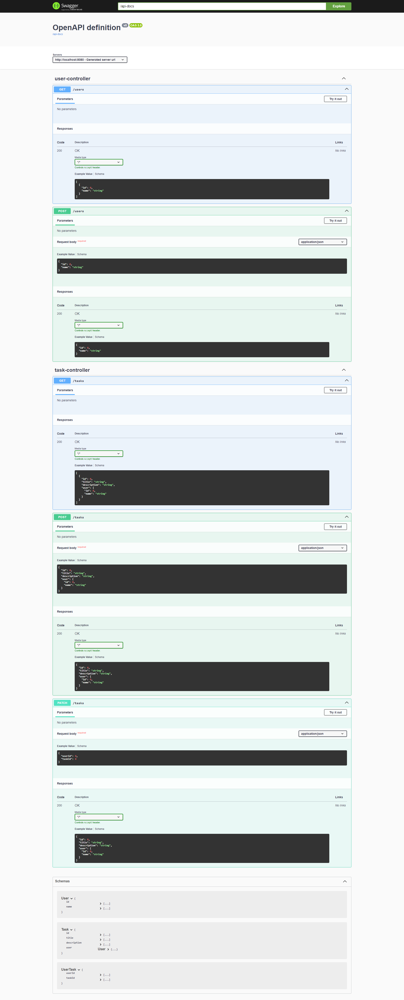

# Task Management - Spring Boot edition.
## Task-Boot-Man

Task-Boot-Man is a Restful API showcase, designed and developed using spring boot. 

Here is the tech stack.

- Spring Boot 3.3.2
- Mockito
- PostgreSQL
- Docker & Docker Compose
- H2 in memory database
- Flyway database versioning
- Swagger
- Unit tests
- End-to-end integration tests
- Mockito
 
## Features

- Users CRUD
- Tasks CRUD
- Task vs User association

## Swagger 

Run the application and hit http://localhost:8080/swagger-ui/index.html

## License

MIT

**Free Software, Hell Yeah!**
